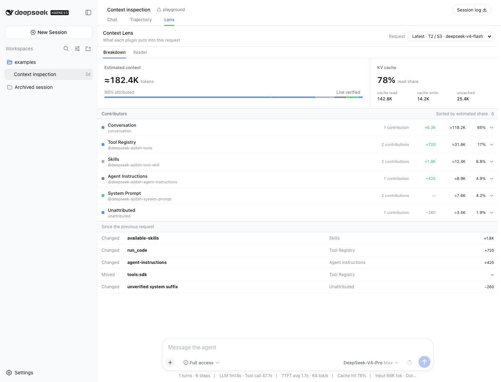
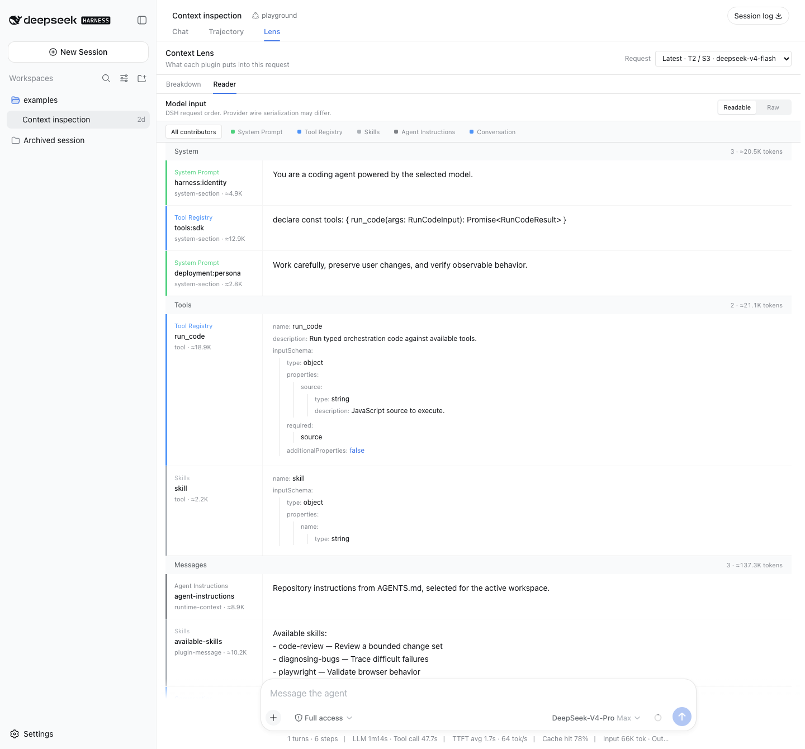
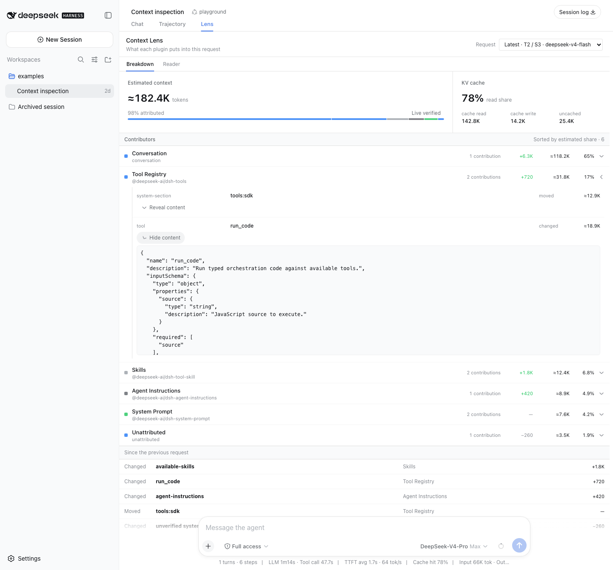

# DSH Context Lens

[English](README.md) | [简体中文](README.zh-CN.md)

> See what every plugin puts into the model.

DSH Context Lens is a read-only observability plugin for [DeepSeek Harness](https://github.com/deepseek-ai/deepseek-harness). It adds a **Lens** view beside Chat and Trajectory, reconstructs each ordinary Agent request, and shows which plugins contributed its system prompt, runtime context, tools, and plugin messages.

> [!WARNING]
> **Work in progress.** Context Lens is under active development and may still contain substantial bugs or incomplete behavior. Some metrics may be inaccurate, especially estimated context token counts and KV cache read/hit ratios. Verify important conclusions against provider-reported data, and please [open an issue](https://github.com/KinomotoMio/dsh-context-lens/issues/new) when something looks wrong.
>
> Near-term work: [frontend usability](https://github.com/KinomotoMio/dsh-context-lens/issues/1) · [data accuracy](https://github.com/KinomotoMio/dsh-context-lens/issues/2) · [attribution coverage and DSH compatibility](https://github.com/KinomotoMio/dsh-context-lens/issues/3).

## Preview



Captured in the DSH `0.1.0-rc.7` Web UI with an illustrative, non-sensitive request snapshot.

The view reuses DSH Web's UI primitives, typography, surfaces, and `--dsw-*` design tokens. Local CSS defines only the Lens-specific contribution meter, disclosure rows, and ordered reader layout.

### Read the request in order



**Reader** presents the selected request as one continuous document. System sections, tools, runtime context, plugin messages, and conversation messages stay in DSH request order, so contributions can appear as A–B–A instead of being regrouped by plugin. Select a contributor to focus its blocks without moving them, or switch between readable and raw representations.

<details>
<summary>Progressive disclosure: inspect a contribution, then load its content</summary>



</details>

## What the Lens shows

The default **Breakdown** view stays at the attribution level:

- one stacked bar for the estimated model input;
- one row per plugin with estimated tokens, share, and change from the previous request;
- explicit `Conversation`, `Unattributed`, and `Conflicted` rows;
- provider-reported uncached input, cache read, cache write, and cache read / billed input;
- added, removed, changed, and moved contributions beside the cache figures.

Select a plugin to inspect its named sections, runtime contexts, tools, and plugin messages. Full prompt text and JSON schemas are fetched only after selecting **Reveal content**. They are not included in the initial snapshot response.

Breakdown rows and stacked-bar segments are sorted by estimated share. They are proportions, not a request timeline. **Reader** is the ordered view: it keeps System, Tools, and Messages as separate request planes, then preserves the original order inside each plane. That is DSH's provider-neutral request order; a provider may serialize roles, tool schemas, or framing differently on the wire.

The request selector opens on the latest ordinary generation. Compaction, session-title generation, and other auxiliary model calls are outside the v1 request catalog.

## Install

Version `0.1.0` targets the DSH `0.1.0-rc.7` public APIs. Until the package is published, build a tarball from a checkout next to the Harness checkout:

```text
projects/
├── deepseek-harness/
└── dsh-context-lens/
```

```sh
cd dsh-context-lens
pnpm install
pnpm build
pnpm pack --pack-destination .artifacts

dsh plugin --profile web add .artifacts/kinomotomio-dsh-context-lens-0.1.0.tgz
dsh --profile web
```

The package declares both `dsh.bundle.patch` and `dsh.client` metadata. Installing it adds the Host observer to the profile and the browser client to the Web roster. It does not require a DeepSeek Harness source modification.

## Attribute your plugin

Context Lens first uses explicit provenance already present on a Session event. For named system sections, runtime contexts, and tools, a plugin can register exact claims through the calling Cordis fiber:

```ts
export function apply(ctx: Context): void {
  ctx.pluginContextLens.claim({
    label: 'Repository Map',
    sections: ['repo-map:instructions'],
    contexts: ['repo-map:snapshot'],
    tools: ['repo_map'],
  })
}
```

The returned disposer is owned by the calling effect scope, so the claim disappears when that plugin unloads. Names are exact and case-sensitive; Context Lens does not use prefixes, package-name guesses, or fuzzy matching.

For a third-party plugin that cannot call the seam, configure the same claim statically:

```yaml
- id: plugin-context-lens
  name: '@kinomotomio/dsh-context-lens'
  config:
    claims:
      - plugin: '@example/repository-map'
        label: Repository Map
        sections: ['repo-map:instructions']
        contexts: ['repo-map:snapshot']
        tools: ['repo_map']
```

Resolution order is:

1. the contribution event's `source.plugin`;
2. a live `claim()` from the contributing fiber;
3. an operator-configured claim;
4. the built-in DSH manifest, one package at a time and only on an exact version match;
5. `Unattributed`.

Two owners at the same priority produce `Conflicted`; the Harness continues running. The first built-in manifest covers DSH `0.1.0-rc.7`. A package whose installed version differs is not attributed from that manifest and produces an accuracy note in the Lens.

## KV cache analysis

Context Lens displays the provider's token accounting next to structural contribution changes. The cache read share is:

```text
cache read / (uncached input + cache read + cache write)
```

These provider figures remain separate from the plugin token estimate. A simultaneous contribution change and cache change is useful correlation for debugging prefix stability, but it is not proof that one caused the other. If the provider reports no cache fields, the Lens says so and does not estimate a hit rate.

## Accuracy model

- Plugin shares use the same fixed-density estimator as DSH token-meter and always display `≈`.
- Provider input and cache tokens are shown as reported; they are not redistributed across plugins.
- Live system-section boundaries are retained only when the captured structured assembly renders to the exact `request/header.system` value. A mismatch collapses the complete rendered system prompt into `Unattributed` rather than guessing.
- Cold Sessions are inspected through `sessionPersistence.inspect()` and reconstructed from their log. Structured system boundaries are process-local, so a cold request normally uses the conservative flattened fallback.
- Tool and message surface replacement follows DSH's public Session fold, including compacted or replaced history.
- Reader preserves the analyzer's DSH request order and never regroups blocks by plugin. It does not claim to reproduce provider-specific wire or KV-cache prefix serialization.

## Privacy and lifecycle

The plugin appends no Session events, writes no sidecar files, uploads no data, and adds no telemetry. It keeps only the two most recent live structured system assemblies per Session in memory by default, then clears them when the Session is released. Snapshot, document, and detail RPCs use a dedicated `/dsh-plugin-context-lens` trusted-host channel with versioned strict schemas.

The initial Breakdown snapshot contains metadata, not contribution bodies. **Reveal content** loads one body; entering **Reader** is a separate explicit disclosure that loads every body in the selected request. Either action can expose system prompts, tool schemas, and conversation content to the browser, so use the Lens only on a Host deployment whose browser access policy you trust.

## Development

The DSH `0.1.0-rc.7` packages used for type and integration tests are linked from the adjacent `deepseek-harness` checkout and are never included as runtime dependencies in the tarball. The manifest test requires that checkout to be the exact `dsh-v0.1.0-rc.7` commit and verifies every built-in package version and contribution name against its source.

```sh
pnpm install
pnpm typecheck
pnpm lint
pnpm test
pnpm build
pnpm pack:check
```

CI runs these checks on Node 22 and 24 and verifies the packed Host, client module wrapper, declarations, and profile bundle metadata.

## License

[MIT](LICENSE) © 2026 KinomotoMio.
